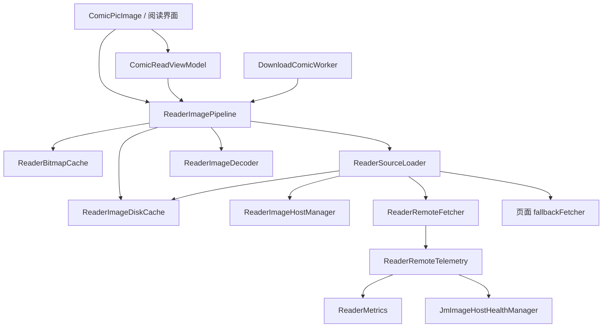
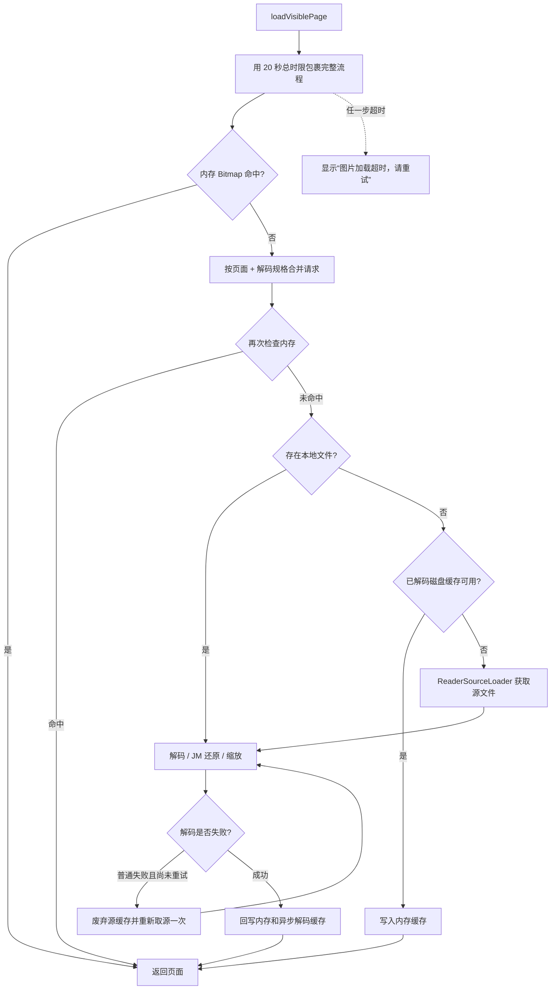

# ReaderImagePipeline 图片链路说明

本文档说明当前阅读器图片链路中各个组件的实际功能、调用关系和行为边界。内容以
`v1.4.0` 当前代码为准，主要覆盖在线阅读、本地阅读、图片预加载和漫画下载共用的图片处理流程。

## 1. 这套链路解决什么问题

从用户视角看，这套链路负责以下体验：

- 当前正在看的图片优先于预加载和后台下载。
- 同一页被界面、预加载或下载同时请求时，尽量共用网络源文件，避免重复下载。
- 优先读取内存、已解码磁盘缓存和原始图片缓存，只有全部未命中时才访问网络。
- 根据 CDN 历史延迟和健康状态选择来源；当前页最多尝试两个来源。
- 网络正常时可对两个候选 CDN 做延迟竞速；所有已知节点普遍变慢时改为顺序尝试。
- 图片下载后完成格式校验、JM 分段还原、尺寸限制和内存保护，再交给界面显示。
- 低内存设备减少预加载和解码压力，避免长章节把所有页面 Bitmap 长期留在内存中。
- 清理缓存时保留仍有租约的源文件，并阻止旧后台写入重新污染已清空的缓存。

缩放、拖动画面和点击翻页属于阅读器手势层，不在本文图片链路范围内，相关实现位于
[`ReaderZoomState.kt`](../app/src/main/java/com/par9uet/jm/ui/screens/readScreen/ReaderZoomState.kt)、
[`ComicPageRead.kt`](../app/src/main/java/com/par9uet/jm/ui/screens/readScreen/ComicPageRead.kt) 和
[`ComicScrollRead.kt`](../app/src/main/java/com/par9uet/jm/ui/screens/readScreen/ComicScrollRead.kt)。

## 2. 总体结构



按项目采用的四层架构理解：

| 层级 | 组件 | 实际职责 |
| --- | --- | --- |
| L1 调用入口 | `ComicPicImage`、阅读界面、`DownloadComicWorker` | 发起显示、预加载或下载需求，不决定 CDN 与缓存细节 |
| L2 协调 | `ComicReadViewModel`、`ReaderImagePipeline`、`ReaderRemoteTelemetry` | 决定请求优先级、加载顺序、预加载范围以及观测数据流向 |
| L3 业务组合 | `ReaderSourceLoader` | 组合源缓存、CDN、网络下载、回退来源和重试，产出一份可解码源文件 |
| L4 底层适配 | `ReaderBitmapCache`、`ReaderImageDiskCache` | 管理 Bitmap 和文件的实际生命周期 |

`ReaderImagePipeline` 直接持有内存、磁盘缓存和解码等选定适配器，是刻意保留的 L2 例外。
缓存命中与解码结果决定是否继续进入后续流程，将它们再包进只负责转发的 L3，会隐藏
“内存 → 本地/磁盘 → 来源 → 解码 → 回写”这条关键控制流。完整架构约束见
[`ARCHITECTURE.md`](../ARCHITECTURE.md)。

### 2.1 组件索引

| 代码组件 | 当前实际功能 |
| --- | --- |
| [`ReaderImagePipeline`](../app/src/main/java/com/par9uet/jm/reader/ReaderImagePipeline.kt) | 图片链路总协调器；决定优先级、缓存查找顺序、解码顺序、并发和总时限 |
| [`ReaderSourceLoader`](../app/src/main/java/com/par9uet/jm/reader/molecule/ReaderSourceLoader.kt) | 把源缓存、CDN、竞速、完整候选回退和页面字节回退组合成可解码文件 |
| [`ReaderBitmapCache`](../app/src/main/java/com/par9uet/jm/reader/atom/ReaderBitmapCache.kt) | 按页面和画质持有有限数量 Bitmap，并响应 Android 内存压力 |
| [`ReaderImageDiskCache`](../app/src/main/java/com/par9uet/jm/reader/atom/ReaderImageDiskCache.kt) | 管理源文件、解码文件、临时文件、引用计数、异步写入和容量裁剪 |
| [`ReaderRemoteTelemetry`](../app/src/main/java/com/par9uet/jm/reader/coordinator/ReaderRemoteTelemetry.kt) | 把 HTTP 事件转成 Debug 指标与 CDN 健康反馈 |
| [`ReaderImageModels`](../app/src/main/java/com/par9uet/jm/reader/ReaderImageModels.kt) | 定义页面、结果、优先级、解码规格、稳定身份和缓存 Key |
| [`ReaderInFlightRegistry`](../app/src/main/java/com/par9uet/jm/reader/ReaderInFlightRegistry.kt) | 合并相同任务、跟踪消费者、提升优先级并控制取消时机 |
| [`ReaderNetworkScheduler`](../app/src/main/java/com/par9uet/jm/reader/ReaderNetworkScheduler.kt) | 分配前台/后台 HTTP 槽位，并让推测任务为当前页让路 |
| [`ReaderDynamicLimiter`](../app/src/main/java/com/par9uet/jm/reader/ReaderDynamicLimiter.kt) | 提供可在运行中改变上限的轻量并发许可池 |
| [`ReaderConcurrencyPolicy`](../app/src/main/java/com/par9uet/jm/reader/ReaderConcurrencyPolicy.kt) | 把设备内存和用户设置换算成安全的解码并发 |
| [`ReaderPrefetchPolicy`](../app/src/main/java/com/par9uet/jm/reader/ReaderPrefetchPolicy.kt) | 计算预加载距离、源文件模式和 worker 数量 |
| [`ReaderPrefetchPlanner`](../app/src/main/java/com/par9uet/jm/reader/ReaderPrefetchPlanner.kt) | 根据可见区间和方向生成具体的预加载页码顺序 |
| [`ReaderHedge`](../app/src/main/java/com/par9uet/jm/reader/ReaderHedge.kt) | 限制当前页来源数、判断是否竞速，并包装当前页总时限 |
| [`ReaderImageHostManager`](../app/src/main/java/com/par9uet/jm/reader/ReaderImageHostManager.kt) | 安全改写镜像域名、读取节点排名并预热连接 |
| [`ReaderRemoteFetcher`](../app/src/main/java/com/par9uet/jm/reader/ReaderRemoteFetcher.kt) | 执行单来源或双候选 HTTP 请求，只把有效 body 写入临时文件 |
| [`ReaderImageDecoder`](../app/src/main/java/com/par9uet/jm/reader/ReaderImageDecoder.kt) | 校验图片、解码、调用分段还原并按规格缩小 Bitmap |
| [`ReaderScramble`](../app/src/main/java/com/par9uet/jm/reader/ReaderScramble.kt) | 计算 JM 分段数量、源区间、采样边界和目标尺寸 |
| [`ReaderLruCache`](../app/src/main/java/com/par9uet/jm/reader/ReaderLruCache.kt) | 提供线程安全、按访问顺序淘汰的通用小型 LRU |
| [`ReaderMetrics`](../app/src/main/java/com/par9uet/jm/reader/ReaderMetrics.kt) | 在 Debug 构建中累计缓存、网络、竞速、主机和耗时数据 |
| [`JmImageHostHealthManager`](../app/src/main/java/com/par9uet/jm/image/JmImageHostHealthManager.kt) | Reader 与封面共用的节点探测、排序、冷却、持久化和网络切换控制器 |

## 3. 调用入口与实际触发时机

### 3.1 页面显示

[`ComicPicImage.kt`](../app/src/main/java/com/par9uet/jm/ui/components/ComicPicImage.kt) 是单张图片的
Compose 显示入口：

1. 根据 `pageKey` 创建当前页请求。
2. 调用 `ReaderImagePipeline.loadVisiblePage()`。
3. 加载期间显示进度环。
4. 成功后把 Bitmap 转成 `ImageBitmap`，并把真实宽高比写回页面状态。
5. 失败后显示可读错误和“重试”按钮；重试只增加 `retryToken`，不会创建另一套加载逻辑。
6. Compose 协程被取消时继续向下传播取消，不把正常的页面离场显示成错误。

### 3.2 当前页和预加载调度

[`ComicReadViewModel.kt`](../app/src/main/java/com/par9uet/jm/ui/viewModel/ComicReadViewModel.kt) 负责阅读进度
变化带来的调度：

- `decodeIndex()` 用于单页翻页或点击翻页模式。
- `decodeVisibleRange()` 用于长条滚动模式，可同时考虑当前可见区间的首尾页。
- `loadVisible()` 提前启动当前页请求并预热连接。
- `schedulePrefetch()` 根据方向、速度、跳页距离和设备能力安排后续页面。
- 换章节、重新获取页面列表或 ViewModel 销毁时，`resetReaderRequests()` 取消旧的当前页任务和预加载。

界面自身和 ViewModel 可能同时请求当前页。这不是两次实际下载：
`ReaderInFlightRegistry` 会把相同页面、相同解码规格的请求合并，并把已有预加载提升为当前页优先级。

### 3.3 后台漫画下载

[`DownloadComicWorker.kt`](../app/src/main/java/com/par9uet/jm/worker/DownloadComicWorker.kt) 通过
`loadForDownload()` 复用相同的来源下载、校验和 JM 图片还原逻辑：

- 使用 `DOWNLOAD` 解码规格，不复用面向屏幕显示的低清 Bitmap。
- 单页在 Worker 外层还有 180 秒超时。
- 解码完成后由 Worker 以 WebP 质量 50 写入漫画下载目录。
- 已存在的页面文件直接跳过。
- 整个 WorkManager 任务最多尝试 6 次。
- Worker 创建的页面当前不提供 `fallbackFetcher`，因此离线下载会使用已缓存源或完整 CDN 候选列表。

### 3.4 对象创建

[`ComicModule.kt`](../app/src/main/java/com/par9uet/jm/di/ComicModule.kt) 把 `ReaderImagePipeline` 注册为
Koin 单例。因此一个 App 进程中的阅读界面和下载任务共享：

- 内存缓存；
- 磁盘缓存目录；
- 正在执行的请求注册表；
- CDN 健康状态；
- 网络连接池和并发槽位。

## 4. 页面数据与缓存身份

相关定义位于
[`ReaderImageModels.kt`](../app/src/main/java/com/par9uet/jm/reader/ReaderImageModels.kt) 和
[`ComicPicImageState.kt`](../app/src/main/java/com/par9uet/jm/data/models/ComicPicImageState.kt)。

### `ComicPicImageState`

这是章节列表中长期存在的页面元数据，只保存页码、漫画 ID、图片地址、解扰参数和宽高比，
不保存 Bitmap。这样一个数百页章节不会因为列表仍存在而永久占住全部图片内存。
宽高比初始使用 9:16 占位，真实图片加载后更新，并限制在 0.05～8 之间，避免异常尺寸破坏布局。

### `ReaderPageKey`

一页图片的稳定身份由以下字段组成：

- `comicId`：漫画或章节 ID；
- `pageIndex`：章节内页序号；
- `sourceIdentity`：图片来源身份；
- `scrambleId`：JM 图片还原阈值；
- `speed`：是否需要还原的协议字段。

对于受支持的 JM 镜像地址，同一路径在不同 CDN 域名下会归一为同一个逻辑来源，URL 查询参数也
不参与源缓存身份。实际网络请求仍保留原路径和查询参数。这样切换 CDN 不会为同一页产生多份缓存。
非 JM 域名或不允许镜像的路径不会被归一化。

### `ReaderPage`

`ReaderPage` 是一次加载所需的完整输入：

- `localFile` 存在时直接读取本地图片，不访问 CDN；
- `originSrc` 用于生成 CDN 候选和判断 GIF；
- `fallbackFetcher` 是可选的 API 字节回退入口；
- 解扰所需参数与 `ReaderPageKey` 一起传入解码器。

### `ReaderDecodedPage`

最终交给界面的结果只有：

- 已还原、已限制尺寸的 `Bitmap`；
- 原始页面宽高比 `aspectRatio`。

## 5. 三种解码规格

| 规格 | 使用场景 | 最大宽度 | 最大像素数 | Bitmap 格式 | 解码缓存 WebP 质量 |
| --- | --- | ---: | ---: | --- | ---: |
| `HIGH` | 默认在线/本地阅读 | 1440 px | 1200 万 | `ARGB_8888` | 92 |
| `LOW` | 开启图片内存优化后的阅读 | 900 px | 400 万 | `RGB_565` | 86 |
| `DOWNLOAD` | 离线漫画下载 | 4096 px | 4000 万 | `ARGB_8888` | 不写阅读器解码缓存 |

阅读器在“图片内存优化”关闭时使用 `HIGH`，开启时使用 `LOW`。下载始终使用 `DOWNLOAD`，
不会因为用户的阅读画质设置降低离线文件的解码上限。

## 6. `ReaderImagePipeline`：加载总协调器

核心文件：
[`ReaderImagePipeline.kt`](../app/src/main/java/com/par9uet/jm/reader/ReaderImagePipeline.kt)。

它保留的是需要从一个位置看清的流程决策，而不是底层网络或文件细节。

### 对外能力

| 方法 | 实际功能 |
| --- | --- |
| `loadVisiblePage(page)` | 以最高优先级加载当前页；整个流程统一受 20 秒时限约束 |
| `loadForDownload(page)` | 以后台优先级和 `DOWNLOAD` 规格解码；不写屏幕 Bitmap/解码缓存 |
| `prefetchPage(page)` | 设备允许时提前下载并解码；单槽位设备自动退化为只预取源文件 |
| `prefetchPageSource(page)` | 只准备可解码源文件，不创建 Bitmap |
| `adaptivePrefetchPolicy(...)` | 根据设备、翻页行为和网络延迟计算预加载距离与并行度 |
| `warmImageConnections(page)` | 对排名靠前的 CDN 发起 HEAD 预热，减少第一次正式请求的连接成本 |
| `cancelPrefetch(pageKey)` | 取消已不再需要且没有当前页/下载消费者的指定预加载 |
| `cancelAllPrefetch()` | 换章节、退出阅读等场景取消全部推测性工作 |
| `clearMemory()` | 清空阅读器 Bitmap LRU；当前仍由界面持有的图片不会被强制回收 |
| `clearDiskCache()` | 清理阅读器源文件和解码文件；正在使用的源文件延迟到租约释放后删除 |
| `metricsSnapshot()` | Debug 构建中读取请求、缓存、网络、竞速和耗时统计 |
| `imageHostSnapshot()` | 读取 CDN 顺序、首选节点、延迟和冷却状态 |
| `close()` | 取消任务、关闭缓存通道、网络连接和观测协程；提供完整单例释放入口 |

当前生产代码把管线作为进程级单例使用，没有在普通页面退出时调用 `close()`。页面退出只取消对应
当前页消费者和预加载，保留缓存与连接供下一次阅读复用。

### 当前页完整流程



内存在进入共享请求前后各检查一次。第一次是最快路径；第二次用于处理“等待加入共享请求期间，
另一请求已经完成并写入内存”的竞态。

### 解码失败后的恢复

源文件解码失败时，管线会：

1. 判断错误是否允许重新取源；
2. 删除损坏的持久源缓存或释放临时源；
3. 从来源层重新获取一次；
4. 再解码一次。

取消和 `OutOfMemoryError` 不触发网络重试：取消应立即结束；OOM 通常是设备内存问题，重新下载
相同文件没有帮助。其他解码错误最多进行一次换源重试，避免无限循环。

## 7. `ReaderSourceLoader`：来源组合层

核心文件：
[`ReaderSourceLoader.kt`](../app/src/main/java/com/par9uet/jm/reader/molecule/ReaderSourceLoader.kt)。

它的产物不是 Bitmap，而是一份经过基本格式校验、可以安全交给解码器的文件租约。

### 来源查找顺序

1. 查找稳定的 `.source` 磁盘缓存。
2. 未命中时从 `ReaderImageHostManager` 获取已排序 URL。
3. 当前页按竞速规则或顺序规则尝试最多两个来源。
4. 非当前页任务可顺序尝试完整候选列表。
5. 非当前页任务在网络失败时可使用页面的 `fallbackFetcher`。
6. 下载完成后写入临时文件并做大小、格式和尺寸校验。
7. 根据请求类型决定是否把临时源复制为持久源缓存。

`fallbackFetcher` 当前由在线章节页面状态提供。实现只在请求仍为非当前页状态时调用它，因此
直接发起的当前页请求不会进入该回退分支；如果预加载已经通过回退得到持久源，之后当前页仍能
直接命中该源缓存。

### 源文件是否持久化

| 请求类型 | 源文件处理 |
| --- | --- |
| 当前页 `VISIBLE` | 校验成功后强制保留稳定源缓存 |
| 预加载 `PREFETCH` | 校验成功后保留稳定源缓存 |
| 后台下载 `BACKGROUND` | 默认只在本次解码期间保留临时源，避免离线下载再占一份阅读缓存 |

如果不同类型正在共享同一源请求，当前页加入后可以提升该请求优先级，并要求把有效源保留下来。

## 8. CDN 排序、竞速和连接预热

### `ReaderImageHostManager`

文件：
[`ReaderImageHostManager.kt`](../app/src/main/java/com/par9uet/jm/reader/ReaderImageHostManager.kt)。

实际功能：

- 只对 HTTPS、已登记 JM 图片域名和允许的媒体路径替换域名。
- 替换域名时完整保留路径和查询参数。
- 从共享健康管理器读取首选节点、延迟和冷却状态并生成候选顺序。
- 对前 3 个候选发送 HEAD 预热；同一主机 4 分钟内不重复预热。
- 网络切换时清空预热记录和连接池，避免继续使用旧网络连接。

共享健康状态位于
[`JmImageHostHealthManager.kt`](../app/src/main/java/com/par9uet/jm/image/JmImageHostHealthManager.kt)：

- 成功响应头耗时以 TTFB 形式进入 EWMA 延迟；
- 首选节点取当前未冷却节点中历史延迟最低者；
- 网络或主机级失败进入 120 秒冷却；
- 404、空内容、格式错误等资源级问题不会把整个 CDN 判为故障；
- 延迟和首选节点会持久化；网络发生变化后清空旧测量并重新探测。

### `ReaderHedge`

文件：[`ReaderHedge.kt`](../app/src/main/java/com/par9uet/jm/reader/ReaderHedge.kt)。

当前页来源规则：

- 候选 URL 去重后只取前 2 个。
- 已知最快节点 TTFB 小于 450 ms，或尚无样本时，可以竞速。
- 已知最快节点 TTFB 达到 450 ms 时，判定所有可用节点整体偏慢，关闭竞速并按顺序尝试。
- 无论单个 OkHttp 请求的超时如何，当前页整体仍受管线 20 秒总时限约束。

### `ReaderRemoteFetcher`

文件：
[`ReaderRemoteFetcher.kt`](../app/src/main/java/com/par9uet/jm/reader/ReaderRemoteFetcher.kt)。

竞速不是同时下载两份完整图片：

1. 先启动第一候选。
2. 第一候选 100 ms 内返回成功响应头时，直接读取它的 body，不启动第二候选。
3. 100 ms 内没有可用响应头时，启动第二候选。
4. 根据成功响应头选出赢家，取消并关闭输家。
5. 只有赢家创建临时文件并读取 body。

下载过程中每 12 ms 检查一次是否出现当前页请求。后台请求需要让路时会取消当前 HTTP 调用、
删除未完成临时文件、释放网络槽位，并在调度层等待后续机会。

远端读取同时检查：

- HTTP 状态；
- `Content-Length` 是否为 0 或超过 40 MB；
- 实际流式读取总量是否超过 40 MB；
- body 是否为空；
- 临时文件能否解析出有效图片尺寸。

## 9. 请求合并和优先级提升

文件：
[`ReaderInFlightRegistry.kt`](../app/src/main/java/com/par9uet/jm/reader/ReaderInFlightRegistry.kt)。

优先级从高到低为：

1. `VISIBLE`：用户当前正在看的页面；
2. `BACKGROUND`：离线下载；
3. `PREFETCH`：尚未显示、可以取消的推测性加载。

这里存在两级请求合并：

| 注册表 | Key | 解决的问题 |
| --- | --- | --- |
| 解码请求注册表 | 逻辑页面 + 解码规格 | 同一页面的多个 UI 消费者共用一次解码；不同画质不错误共用 Bitmap |
| 源请求注册表 | 逻辑页面源身份 | `HIGH`、`LOW`、`DOWNLOAD` 可共用同一份网络源文件 |

已有预加载被当前页请求加入时，不会取消后重新开始，而是原地提升为 `VISIBLE`。最后一个消费者
离开、任务又尚未完成时，会保留 750 ms 的重加入窗口；短暂的 Compose 重组或页面切换不会立即
浪费已经进行到一半的请求。失败和取消的条目会移除，后续当前页可以正常重试。

## 10. 网络并发与前台让路

文件：
[`ReaderNetworkScheduler.kt`](../app/src/main/java/com/par9uet/jm/reader/ReaderNetworkScheduler.kt) 和
[`ReaderDynamicLimiter.kt`](../app/src/main/java/com/par9uet/jm/reader/ReaderDynamicLimiter.kt)。

### 总网络槽位

| 设备条件 | 网络总并发 |
| --- | ---: |
| 低内存设备，或 `memoryClass < 384 MB` | 1 |
| `384 MB <= memoryClass < 512 MB` | 2 |
| `memoryClass >= 512 MB` | 3 |

后台槽位通常为 1。当设备至少有 3 个总槽位且用户预加载设置达到 5 张时，后台槽位提高到 2，
仍至少给当前页保留一个可抢占机会。

后台任务在排队、取得后台槽位、取得总槽位以及读取 body 时都会重新检查是否有当前页请求，
避免“明明当前页已经出现，旧预加载却因为更早排队而先占用网络”。

### 解码并发

文件：
[`ReaderConcurrencyPolicy.kt`](../app/src/main/java/com/par9uet/jm/reader/ReaderConcurrencyPolicy.kt)。

- 低内存设备或 `memoryClass < 384 MB` 的硬件上限为 1。
- 其他设备允许用户在 1～4 之间设置解码并发。
- 图片内存优化关闭时，不使用历史隐藏设置，而是恢复硬件默认：低内存设备 1，普通设备 2。
- 图片内存优化开启时，使用用户设置，但仍受硬件上限约束。
- 设置运行时变化会立即调整下一次许可获取，不需要重启阅读器。
- 当前页可使用全部解码槽位；预加载只使用剩余后台预算。

## 11. 自适应预加载

相关文件：

- [`ReaderPrefetchPolicy.kt`](../app/src/main/java/com/par9uet/jm/reader/ReaderPrefetchPolicy.kt)：计算距离、
  是否只取源、并行度；
- [`ReaderPrefetchPlanner.kt`](../app/src/main/java/com/par9uet/jm/reader/ReaderPrefetchPlanner.kt)：把距离变成有顺序的页码；
- [`ComicReadViewModel.kt`](../app/src/main/java/com/par9uet/jm/ui/viewModel/ComicReadViewModel.kt)：采集实际翻页行为并执行计划。

### 距离计算

用户设置范围为 0～6 张，算法内部绝对上限为 12 张。实际距离会受到以下条件影响：

| 条件 | 调整 |
| --- | ---: |
| 低内存设备或 `memoryClass < 384 MB` | 最多 2 张 |
| `384 MB <= memoryClass < 512 MB` | 最多 4 张 |
| 页面速度 `>= 3 页/秒` | `+3` |
| 页面速度 `>= 1.5 页/秒` | `+2` |
| 同方向连续至少 3 次 | `+1` |
| 首选网络延迟 `>= 450 ms` | `+1`，更早准备后续页 |
| 一次跳过至少 4 页 | `+2` |

页面速度不是一次采样直接决定，而是按“旧值 65% + 新值 35%”平滑，并限制在 0～8 页/秒。

### 页码顺序

- 长条滚动模式只沿当前移动方向准备页面。
- 翻页和点击模式会把主要方向放在前面，并保留少量反方向页面，方便用户回看。
- 当前可见区间不会重复加入预加载列表。
- 新计划出现后会取消旧计划中已经不再需要的页面。

### 执行并行度

预加载调度最多创建 1 或 2 个固定 worker，不会为每一页都创建一个无界协程：

- 单网络槽位设备始终为 1，并且只下载源文件，不提前创建 Bitmap。
- 512 MB 以上设备在“预加载 5～6 张”的加速模式，或连续同方向阅读时，可提高到 2。
- 其他情况为 1。

## 12. Bitmap 内存缓存

文件：
[`ReaderBitmapCache.kt`](../app/src/main/java/com/par9uet/jm/reader/atom/ReaderBitmapCache.kt)。

缓存 Key 是“逻辑页面 + 解码规格”，避免 `LOW` 与 `HIGH` 互相覆盖。容量按 Android
`memoryClass` 的八分之一计算，并限制在 16～64 MB。

系统内存压力发生时：

| Android 回调 | 处理 |
| --- | --- |
| `RUNNING_LOW` | 缩减到正常容量的二分之一 |
| `RUNNING_CRITICAL` | 缩减到四分之一 |
| `BACKGROUND` | 缩减到四分之一 |
| `COMPLETE` 或 `onLowMemory()` | 清空 |

淘汰只移除管线持有的缓存引用，不主动 `recycle()`。当前 Compose 页面仍持有 Bitmap 时可以继续显示，
避免内存清理导致正在看的页面崩溃。

## 13. 磁盘缓存与文件租约

文件：
[`ReaderImageDiskCache.kt`](../app/src/main/java/com/par9uet/jm/reader/atom/ReaderImageDiskCache.kt)。

所有阅读器缓存位于 `context.cacheDir/reader_pages`：

| 类型 | 后缀 | 内容 | 缓存命名空间 |
| --- | --- | --- | --- |
| 源缓存 | `.source` | 网络下载后的原始、仍可能需要 JM 还原的图片 | `reader-v2` |
| 解码缓存 | `.webp` | 已还原、已按阅读规格缩放的图片 | `reader-v4` |
| 临时文件 | `.tmp` / 临时 `.source` | 正在下载或写入中的中间文件 | 不作为稳定命中项 |

解码缓存使用 `reader-v4`，用于隔离过去可能含分段接缝的旧缓存，避免升级后继续读取旧产物。

### 容量和写入策略

- 磁盘缓存超过 256 MB 时，按文件修改时间从旧到新清理到约 224 MB。
- 正在使用的源文件不会参与清理。
- 解码后的 WebP 在后台异步写入，不阻塞当前页显示。
- 解码写入通道只保留很小的待办容量；系统繁忙时允许跳过一次缓存写入，优先保证阅读响应。
- 写入先落到临时文件，再重命名或复制为最终文件，避免半写入文件成为有效缓存。

### 为什么源缓存和解码缓存放在一个组件

`clearDiskCache()` 需要同时处理两类文件，并与正在下载、解码和后台写入竞争。组件使用固定锁顺序和
`cacheGeneration` 保证一次清理具有明确边界。如果拆成两个互相调用的 L4 组件，会出现横向依赖，
也更容易产生“清理完成后旧任务又把文件写回来”的竞态。

### 清理期间仍有请求时

每个使用中的源文件都有引用计数：

1. 清理开始时递增 `cacheGeneration`。
2. 不删除 `activeSourceFiles` 中仍被持有的文件。
3. 当前解码继续使用该文件，不受影响。
4. 最后一个租约释放时，发现文件属于旧 generation，再安全删除。

这同时适用于持久源缓存和正在下载的临时源文件。

## 14. 图片校验、JM 还原与缩放

相关文件：

- [`ReaderImageDecoder.kt`](../app/src/main/java/com/par9uet/jm/reader/ReaderImageDecoder.kt)；
- [`ReaderScramble.kt`](../app/src/main/java/com/par9uet/jm/reader/ReaderScramble.kt)。

### 校验边界

- 源文件必须存在，大小在 1 字节～40 MB 之间。
- 图片宽高必须大于 0。
- 原始像素总数不得超过 8000 万。
- 持久化源文件前先只读取图片边界，避免把 HTML 错误页或损坏内容存成有效图片缓存。

### 解码顺序

1. 读取原始宽高。
2. 优先按原始几何尺寸解码，因为 JM 分段还原必须在原始像素坐标中进行。
3. 根据漫画 ID、`scrambleId`、`speed` 和文件名计算分段数量。
4. 如需还原，把源图片纵向分段按协议顺序重新拼合。
5. 完成还原后再一次性缩小到当前解码规格。
6. 返回 Bitmap 和原始宽高比。

GIF、`speed == "1"` 或不满足解扰阈值的页面不会做分段重排。

先完整还原、再统一缩放是为了避免旧式“逐条缩放并拼接”产生横向接缝。若完整解码出现 OOM，
会执行一次 `System.gc()`，然后以至少 2 倍采样重新解码；即使进入该恢复路径，仍保持分段边界按
同一比例映射，不重新引入逐条缩放接缝。

## 15. 指标与 CDN 健康反馈

文件：

- [`ReaderRemoteTelemetry.kt`](../app/src/main/java/com/par9uet/jm/reader/coordinator/ReaderRemoteTelemetry.kt)；
- [`ReaderMetrics.kt`](../app/src/main/java/com/par9uet/jm/reader/ReaderMetrics.kt)。

`ReaderRemoteTelemetry` 把网络执行器的事件分成两条输出：

1. 写入 Reader Debug 指标；
2. 更新共享 CDN 健康状态。

记录内容包括：

- 当前页、预加载、下载请求数；
- 内存、解码磁盘、源文件缓存命中数；
- 网络请求、失败和取消；
- 竞速启动数、第二候选启动数、主/次节点胜出数和输家取消数；
- TTFB、body 下载、完整网络和解码总耗时；
- 当前页 P50、P95、P99，总样本最多保留最近 128 个；
- 各主机成功、失败和竞速胜出次数。

`ReaderMetrics` 只在 Debug 构建启用，Release 不承担这些计数成本。CDN 健康更新不依赖 Debug
开关，正式版本仍会根据真实 TTFB 和主机级失败调整节点顺序。

## 16. 取消、异常和用户看到的结果

| 情况 | 内部处理 | 用户结果 |
| --- | --- | --- |
| 当前页整个流程超过 20 秒 | 结束当前页消费者并抛出 `ReaderImageException`；无其他消费者的共享任务随后按宽限期取消 | 显示“图片加载超时，请重试” |
| HTTP 或主机失败 | 在来源预算内换候选；主机级失败进入冷却 | 成功则无感，全部失败则显示加载失败 |
| 404 或内容错误 | 只判定当前资源失败，不全局冷却 CDN | 尝试另一来源或显示失败 |
| body 为空、超 40 MB、格式损坏 | 删除临时文件，不写入稳定缓存 | 尝试下一来源或显示失败 |
| 已缓存源无法解码 | 删除源缓存并重新取源一次 | 通常自动恢复；再次失败才显示错误 |
| Bitmap OOM | 不重复下载相同源 | 显示“内存不足，无法解码图片” |
| 用户快速翻页 | 取消旧 Compose 消费者和过期预加载 | 新当前页优先，旧任务不会长期占槽 |
| 预加载失败 | 条目移除并记录日志，不弹错误 | 用户真正翻到该页时重新加载 |
| 清理磁盘缓存时页面正在解码 | 保留活动文件，释放后删除 | 当前页面不中断 |

## 17. 关键参数速查

| 参数 | 当前值 | 实际意义 | 代码位置 |
| --- | ---: | --- | --- |
| 当前页总时限 | 20 秒 | 覆盖等待、缓存、网络和解码全过程 | `ReaderImagePipeline` |
| 当前页来源预算 | 2 个 | 防止在多个 CDN 上无限耗时 | `ReaderHedge` |
| 竞速第二候选延迟 | 100 ms | 第一候选响应头未及时到达才启动第二候选 | `ReaderSourceLoader` |
| 普遍慢阈值 | 450 ms TTFB | 达到后关闭当前页竞速，改为顺序尝试 | `ReaderHedge` |
| OkHttp 连接超时 | 15 秒 | 单次连接建立上限 | `ReaderImagePipeline` |
| OkHttp 读取超时 | 30 秒 | 单次 socket 读取等待上限 | `ReaderImagePipeline` |
| OkHttp 调用超时 | 40 秒 | 单个 HTTP 调用上限；当前页仍优先受 20 秒总时限限制 | `ReaderImagePipeline` |
| 最大源文件 | 40 MB | 响应头和实际流式读取都会检查 | `ReaderImageModels` |
| 最大原始像素 | 8000 万 | 防止异常尺寸导致过量内存分配 | `ReaderImageDecoder` |
| Bitmap 缓存 | 16～64 MB | `memoryClass / 8` 后限制范围 | `ReaderBitmapCache` |
| 磁盘缓存上限 | 256 MB | 超出后清到约 224 MB | `ReaderImageDiskCache` |
| 源请求重加入窗口 | 750 ms | 短暂离场后可继续共用未完成任务 | `ReaderInFlightRegistry` |
| CDN 冷却 | 120 秒 | 主机/网络级失败暂时排到后面 | `JmImageHostHealthManager` |
| 连接预热复用 | 4 分钟 | 同主机期间不重复 HEAD 预热 | `ReaderImageHostManager` |
| 预加载绝对上限 | 12 张 | 自适应加成也不能突破 | `ReaderPrefetchPolicy` |

## 18. 常见问题应该先看哪里

| 现象 | 首要检查组件 | 继续检查 |
| --- | --- | --- |
| 当前页一直转圈或超时 | `ReaderImagePipeline`、`ReaderHedge` | `ReaderSourceLoader`、`ReaderRemoteFetcher` |
| CDN 顺序不合理 | `ReaderImageHostManager` | `JmImageHostHealthManager`、`ReaderRemoteTelemetry` |
| 所有节点慢时仍频繁竞速 | `ReaderHedge.readerVisibleSourcePolicy()` | `preferredLatencyMillis()` 是否有有效样本 |
| 预加载阻塞当前页 | `ReaderNetworkScheduler` | `ReaderInFlightRegistry`、ViewModel 的旧计划取消 |
| 重复下载同一页 | 两级 `ReaderInFlightRegistry` Key | `ReaderPageKey` 和逻辑镜像身份 |
| 预加载过多或方向错误 | `ReaderPrefetchPolicy`、`ReaderPrefetchPlanner` | `ComicReadViewModel.updateDirection()` |
| 长章节内存增长 | `ReaderBitmapCache`、解码规格 | `ComicPicImageState` 是否意外持有 Bitmap |
| 图片模糊 | `ReaderDecodeProfile` | 内存优化开关、目标尺寸计算 |
| 图片出现横向接缝或顺序错误 | `ReaderImageDecoder` | `ReaderScramble` 的分段计算 |
| 清缓存后当前页失败 | `ReaderImageDiskCache` | 活动文件引用计数和 generation |
| 点击重试无效 | `ComicPicImage` | 失败请求是否已从注册表移除 |
| 离线下载图片异常 | `DownloadComicWorker` | `loadForDownload()` 和下载目录写入 |

## 19. 修改代码时应保持的边界

- 当前页、下载、预加载的先后顺序只在 L2 协调层决定。
- 来源选择、回退和取源重试集中在 `ReaderSourceLoader`，不要重新散回 UI 或 Worker。
- `ReaderSourceLoader` 不依赖 UI、Worker、Store 或另一个 L3 molecule。
- Bitmap 和文件生命周期分别由缓存组件管理；调用方不直接操作其内部集合、锁或 generation。
- 新 CDN 统计通过 `ReaderRemoteObserver` 事件进入 `ReaderRemoteTelemetry`，不要把统计副作用写进
  body 读取循环。
- 新缓存格式必须更新命名空间，避免旧文件被当作新格式读取。
- 新的源校验应发生在持久化之前，并保证失败临时文件可删除。
- 预加载必须有距离上限、并行上限和取消路径。
- 不要为了目录完整而创建只转发调用的空层；需要例外时在 `ARCHITECTURE.md` 记录原因。

边界自动检查位于
[`ArchitectureBoundaryTest.kt`](../app/src/test/java/com/par9uet/jm/architecture/ArchitectureBoundaryTest.kt)。

## 20. 测试与验证入口

| 测试文件 | 主要覆盖 |
| --- | --- |
| [`ReaderPipelineTest.kt`](../app/src/test/java/com/par9uet/jm/reader/ReaderPipelineTest.kt) | 请求去重、优先级提升、取消重入、缓存 Key、LRU、预加载顺序、解扰与尺寸预算 |
| [`ReaderRemoteFetcherTest.kt`](../app/src/test/java/com/par9uet/jm/reader/ReaderRemoteFetcherTest.kt) | 响应头竞速、第二候选启动、输家取消、临时文件、后台抢占和源请求共享 |
| [`ReaderAccelerationTest.kt`](../app/src/test/java/com/par9uet/jm/reader/ReaderAccelerationTest.kt) | 两来源上限、普遍慢时关闭竞速、20 秒总时限封装、主机顺序和自适应预加载 |
| [`ReaderConcurrencyPolicyTest.kt`](../app/src/test/java/com/par9uet/jm/reader/ReaderConcurrencyPolicyTest.kt) | 硬件上限、内存优化开关、运行时并发变化 |
| [`ReaderImageDiskCacheTest.kt`](../app/src/test/java/com/par9uet/jm/reader/atom/ReaderImageDiskCacheTest.kt) | 清理活动持久源、临时源和非活动缓存的生命周期 |
| [`ArchitectureBoundaryTest.kt`](../app/src/test/java/com/par9uet/jm/architecture/ArchitectureBoundaryTest.kt) | Reader L3/L4 不反向依赖入口层或上层包 |

只验证 Reader 链路和架构边界：

```bash
./gradlew testDebugUnitTest \
  --tests 'com.par9uet.jm.reader.*' \
  --tests 'com.par9uet.jm.architecture.ArchitectureBoundaryTest'
```

提交前完整验证：

```bash
./gradlew testDebugUnitTest lintDebug assembleDebug compileReleaseKotlin
```
